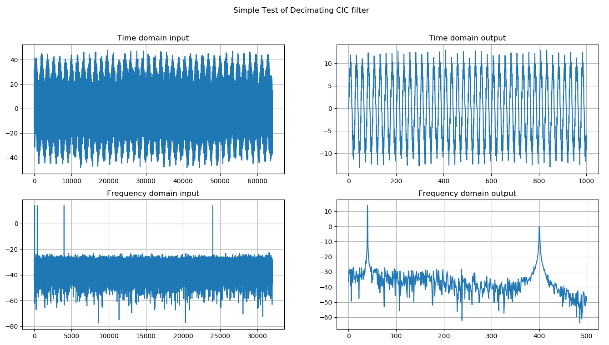

# Decimating CIC-Filter

A simple script to help me understand CIC filters. The decimation rate and stages are selectable. The code is commented so it should be tweak-able.

Integrator and Comb stages are implemented using simple objects which are then instanciated in lists. Each object has an update() method which takes a sample and outputs a sample. These are daisy-chained in for loops. An modulo-if statement decimates the comb section, and creates the output vector.

A simple function computes each input value, and the output is plotted in both the time and frequency domains. If appropriately configured, the script may output the attenuation between two points.

The reference paper this code is based on is also included: [Donadio, M. P.; "CIC Filter Introduction", Jul. 2000;](Donadio_CIC.pdf)

Code supplied on an as-is basis, without warranty or any implied fitness for purpose.

George Smart, M1GEO
16 August 2019.
